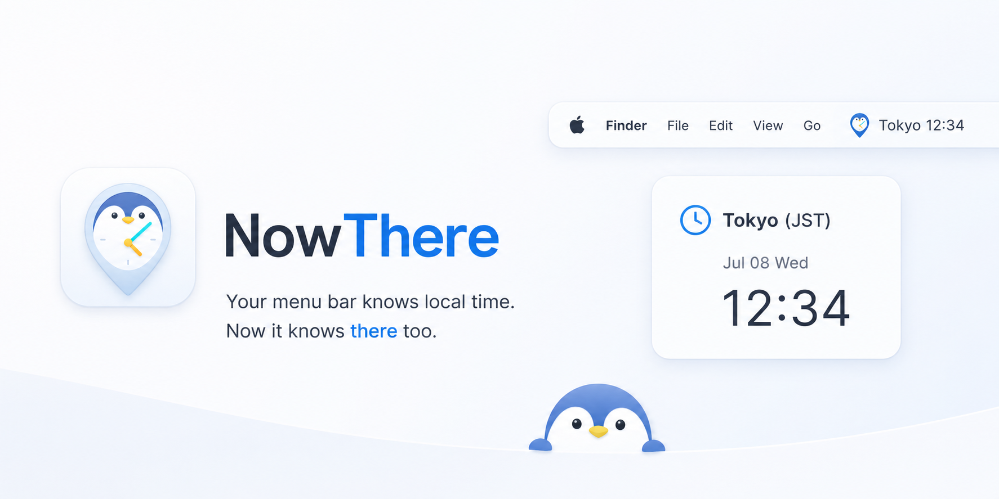

# NowThere

[English](README.md) | [简体中文](README.zh-CN.md) | [日本語](README.ja.md)

<p align="center">
  
</p>

Your menu bar knows local time. Now it knows there too.

NowThere is a native macOS menu bar clock for keeping one important time zone visible at a glance, with a localized, configurable title that stays out of the Dock.

`scripts/build-app-bundle.sh debug` | `open .build/debug/NowThere.app`

---

## Why NowThere?

Remote teams, travel plans, releases, calls, and friends rarely live in your local time zone. NowThere keeps one chosen place in the macOS menu bar, formatted for quick scanning without opening Calendar, Clock, or a browser tab.

It is intentionally small: one selected time zone, a compact title, searchable system time zones, localized English, Simplified Chinese, and Japanese UI, and a menu for the details you need.

## Everyday Uses

- Keep a remote team's city visible before standups, planning sessions, and handoffs.
- Check release windows, client calls, travel plans, or family time without converting in your head.
- Give the clock a custom label like `Work`, `Home`, or a client name so the menu bar stays personal and readable.

## Highlights

### One clock, always visible

NowThere shows a compact text clock directly in the menu bar, such as:

```text
Tokyo Jul 08 Wed 12:34
```

The title updates on minute boundaries, so it stays stable without second-by-second movement.

### Search every system time zone

Pick from macOS' full time zone list. Search by city label, such as `Tokyo`, or by IANA identifier, such as `Asia/Tokyo`.

### Shape the menu bar title

Toggle each title field independently:

- City/Label
- Date
- Weekday
- Time

If every field is hidden, NowThere falls back to the app name instead of leaving an empty menu bar item.

Choose the title style that scans best for you:

- Default
- Time First
- Separated
- Bracketed

Use 24-hour or 12-hour time, and add a custom label such as `Work`, `Home`, or a client name.

### Use your language

Switch the app interface between System, English, Simplified Chinese, and Japanese. The menu UI and menu bar date/weekday text update together.

### Details on click

Open the menu to see the selected time zone's full details:

- City label
- IANA time zone identifier
- Full date
- Full weekday
- Time
- UTC offset

### Native macOS

NowThere is a small AppKit + SwiftUI menu bar app. It uses a native `NSStatusItem` and transient popover, stores preferences in `UserDefaults`, supports launch at login, and packages as an `LSUIElement` app so it does not appear in the Dock.

## Install

There is no signed release build yet. Build and run locally:

```bash
scripts/build-app-bundle.sh debug
open .build/debug/NowThere.app
```

If an older copy is already running:

```bash
pkill NowThere
open .build/debug/NowThere.app
```

## Requirements

- macOS 13+
- Xcode with Swift 6 toolchain

The project was built and tested on macOS 26.4.1 with Xcode 26.5.

## For Developers

Build the executable:

```bash
swift build --product NowThere
```

Run tests:

```bash
swift test
```

Build the app bundle:

```bash
scripts/build-app-bundle.sh debug
```

Verify the menu bar bundle flag:

```bash
/usr/libexec/PlistBuddy -c "Print :LSUIElement" .build/debug/NowThere.app/Contents/Info.plist
```

Expected output:

```text
true
```

## Current Scope

NowThere currently focuses on one selected time zone. It does not support multiple clocks, second-level updates, or custom format templates.

## License

NowThere is released under the MIT License. See [LICENSE](LICENSE).
